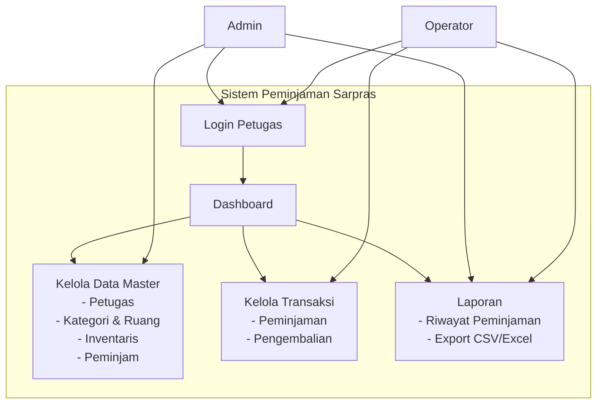
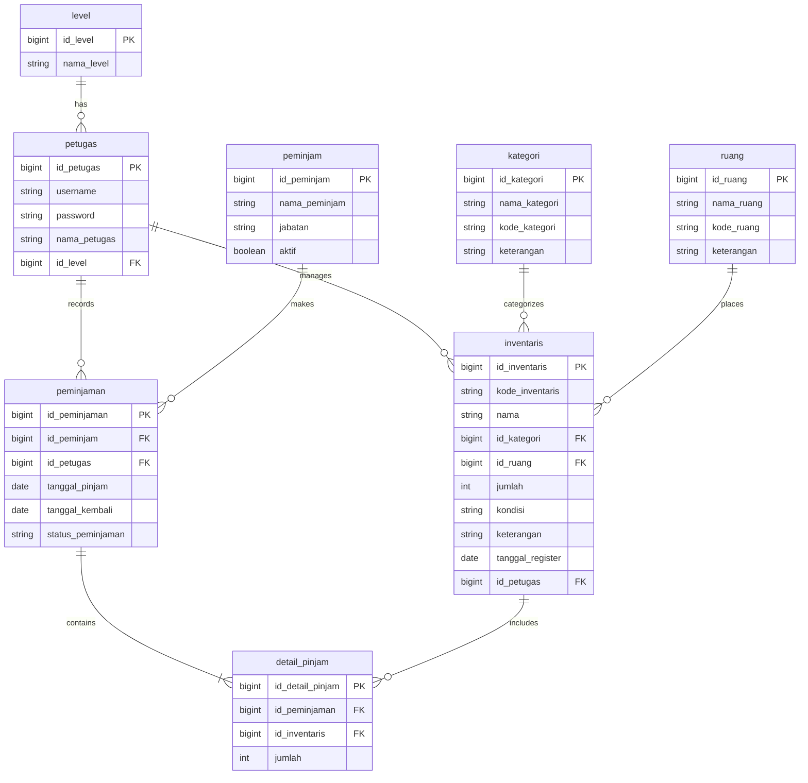

# Diagram Ujikom - Peminjaman Sarpras

## 1. Use Case Diagram

```mermaid
graph TD
    subgraph Sistem Peminjaman Sarpras
        A[Login Petugas] --> B[Dashboard]
        B --> C1[Kelola Data Master<br/>- Petugas<br/>- Kategori & Ruang<br/>- Inventaris<br/>- Peminjam]
        B --> C2[Kelola Transaksi<br/>- Peminjaman<br/>- Pengembalian]
        B --> C3[Laporan<br/>- Riwayat Peminjaman<br/>- Export CSV/Excel]
    end

    Admin[Admin] --> A
    Admin --> C1
    Admin --> C3

    Operator[Operator] --> A
    Operator --> C2
    Operator --> C3
```

## 2. Entity Relationship Diagram (ERD)

```mermaid
erDiagram
    level {
        bigint id_level PK
        string nama_level
    }

    petugas {
        bigint id_petugas PK
        string username
        string password
        string nama_petugas
        bigint id_level FK
    }

    kategori {
        bigint id_kategori PK
        string nama_kategori
        string kode_kategori
        string keterangan
    }

    ruang {
        bigint id_ruang PK
        string nama_ruang
        string kode_ruang
        string keterangan
    }

    inventaris {
        bigint id_inventaris PK
        string kode_inventaris
        string nama
        bigint id_kategori FK
        bigint id_ruang FK
        int jumlah
        string kondisi
        string keterangan
        date tanggal_register
        bigint id_petugas FK
    }

    peminjam {
        bigint id_peminjam PK
        string nama_peminjam
        string jabatan
        boolean aktif
    }

    peminjaman {
        bigint id_peminjaman PK
        bigint id_peminjam FK
        bigint id_petugas FK
        date tanggal_pinjam
        date tanggal_kembali
        string status_peminjaman
    }

    detail_pinjam {
        bigint id_detail_pinjam PK
        bigint id_peminjaman FK
        bigint id_inventaris FK
        int jumlah
    }

    level ||--o{ petugas : has
    petugas ||--o{ inventaris : manages
    petugas ||--o{ peminjaman : records
    kategori ||--o{ inventaris : categorizes
    ruang ||--o{ inventaris : places
    peminjam ||--o{ peminjaman : makes
    peminjaman ||--|{ detail_pinjam : contains
    inventaris ||--o{ detail_pinjam : includes
```
